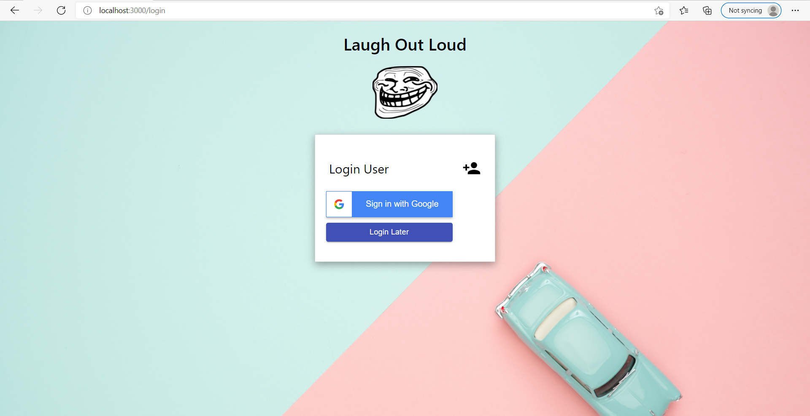

 ## Laugh Out Loud
 
 ### `It is a React Memes App where user can view random memes and also create some.`


 ***This app is built on React and for user saving their favorite meme 'Firebase' is used.***


- **Getting Started with React**: <a href="https://github.com/AyushDubey-maker/laugh-out-loud/blob/master/react-meme-app/README.md"> </a>

```
API'S Used:
- For Fetching random memes: https://meme-api.herokuapp.com/gimme/50

- For Creating random memes: https://api.imgflip.com/get_memes

Learn more about Memes Generator API: https://imgflip.com/api

Note: To generate memes you have to make a free account on https://imgflip.com/ to get a username and password for the API.

```

### `Packages to be installed:`
```
npm install
```
```
react-router-dom
@material-ui/core
@material-ui/icons
firebase

react-google-button
use-clipboard-copy

```

`Note:Do not forget to create your firebase Project and add the firebase config file in your code`

 
 
- Get started with Firebase (Web): https://firebase.google.com/docs/web/setup

- Firebase React Setup:
https://www.codementor.io/@yurio/all-you-need-is-react-firebase-4v7g9p4kf

- Checkout firebase demo file for this app :  
https://github.com/AyushDubey-maker/expense-tracker-react/blob/master/expense-tracker/src/demo-firebase.js

<details>
<summary>View Code Output: </summary>


<p>Login Page:</p>


<p>Generate Memes:</p>


<p>Saved Memes Page:</p>

</details>

> ### Features 📣 :
- View Random memes  
- Save your favourite memes by login into your Google account.
- Create your own meme from provided templates.
- Your Created memes will also get saved in your account.
